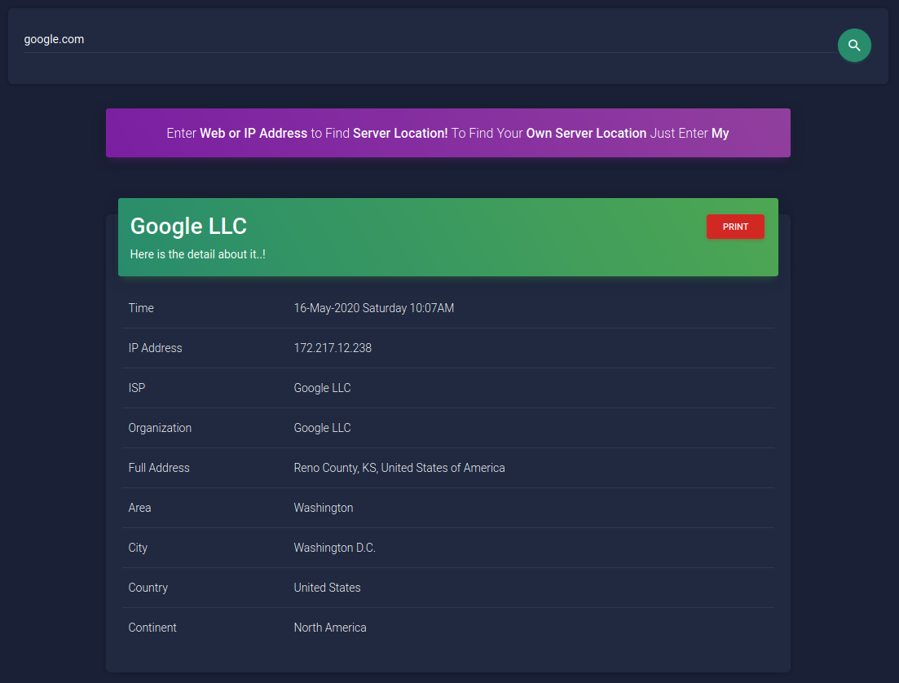
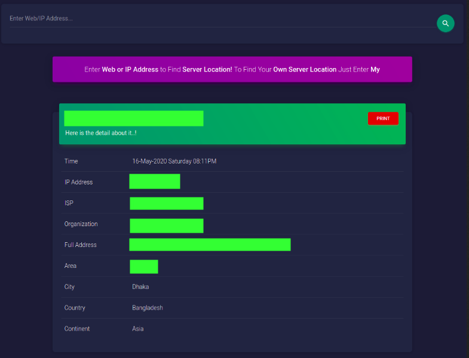
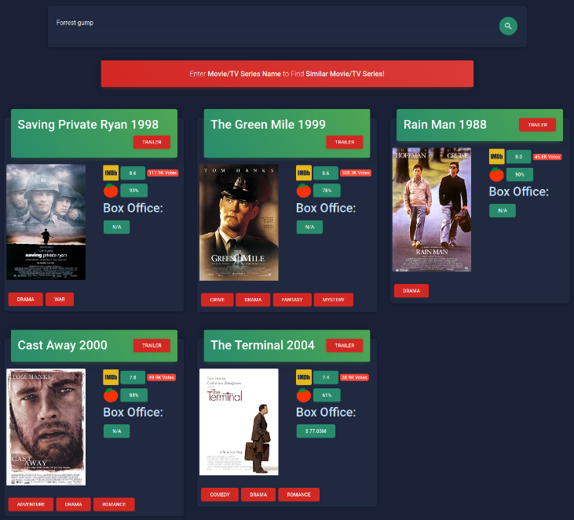
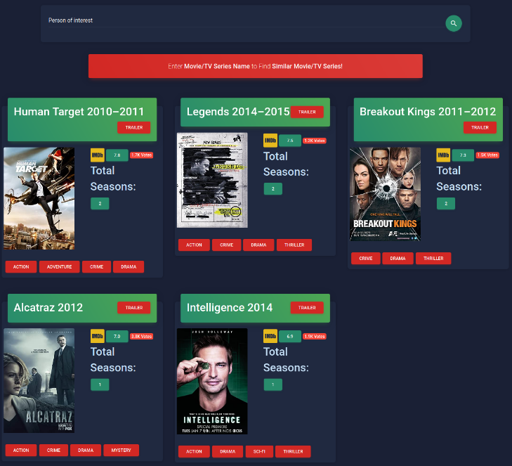

# Web App

## This is a Django based collections of [WebApp](https://prince004.pythonanywhere.com)

* ### [WebLocate App](https://prince004.pythonanywhere.com/weblocate/)
  * Type **Web/IP** address in **search bar** to find **server location**, to find your own **server location** type **my**
  
    <table>
      <tr align='center'>
        <td><b>Locate google server</b> type on search bar <b>google.com</b></td>
        <td><b>Locate own server</b> type on search bar <b>my</b></td>
      </tr>
      <tr>
        <td></td>
        <td></td>
      </tr>
    </table>
* ### [Similar Movie App](https://prince004.pythonanywhere.com/similar/)
  * Type **Movie/TV series** name in **search bar** to find similar **Movie/TV Series** suggestion
  
    <table>
      <tr align='center'>
        <td>Example for <b>movie</b> search</td>
        <td>Example for <b>tv series</b> search</td>
      </tr>
      <tr>
        <td></td>
        <td></td>
      </tr>
    </table>
